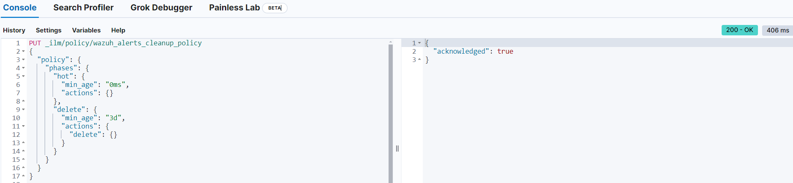

# Elasticsearch Index Lifecycle Overview

Elasticsearch uses Index Lifecycle Management (ILM) to manage data over time. There are four phases:

1. Hot Phase
   - Newest data
   - Most active: frequent updates and searches
   - Needs fastest access

2. Warm Phase
   - Older data
   - Less active: fewer updates, still searched
   - Can be on slightly slower storage

3. Cold Phase
   - Oldest data
   - Rarely accessed, no updates
   - Can be on slowest storage

4. Delete Phase
   - Data no longer needed
   - Removed from the system

Data moves through these phases based on what is called the Index Lifecycle Policy.

# Creating a Lifecycle Policy

## Create Lifecycle Policy for Wazuh Indexes in Elasticsearch

1. Login to Kibana and go to Menu -> Dev Tools

2. Create an ILM policy by copying and pasting the following code and then pressing the run button that looks like a 'play' symbol:

```bash
PUT _ilm/policy/wazuh_alerts_cleanup_policy
{
  "policy": {
    "phases": {
      "hot": {
        "min_age": "0ms",
        "actions": {}
      },
      "delete": {
        "min_age": "30d",
        "actions": {
          "delete": {}
        }
      }
    }
  }
}
```

It will look like so:



3. Perform the same steps for the following snippets of code:

```bash
PUT _index_template/wazuh_alerts_template
{
  "index_patterns": ["wazuh-alerts-4.x-*"],
  "template": {
    "settings": {
      "index.lifecycle.name": "wazuh_alerts_cleanup_policy",
      "index.lifecycle.rollover_alias": "wazuh-alerts"
    }
  }
}
```

```bash
PUT wazuh-alerts-4.x-*/_settings
{
  "index.lifecycle.name": "wazuh_alerts_cleanup_policy"
}
```

This will create a policy, create a template that applies this policy to all new indices, and then also applies the policy to existing wazuh indices.

**NOTE: This is an example that will delete wazuh indices after 30 days. Adjust as needed.**

## Elastic Endpoint Lifecyle policy

Your Elastic agent logs are managed by a policy called "logs"

1. Navigate to Index Lifecycle policies, turn the switch for "Include managed system policies" and then search for "logs"

2. Click to edit this policy. You will see warnings that editing a managed policy can break Kibana, you can mostly ignore this warning if you set your phases properly. 

3. The default setup is to "rollover" once your index is 30 days old or larger than 50 gigabytes. Rollover just means rename the index and create a new one so you keep your shard size down. This will NOT delete the previous index. I.E. logs-00001 rolls over to logs-00002. 00001 remains, its just not 'active'

4. Set your Hot, Warm, Cold phase as you see fit. 

5. After you turn on "Cold Phase" you will most likely have to hit the trash can switch to turn on the delete phase. 

6. After you apply these changes to your policy please allow it some time to actually take effect on all indices.

