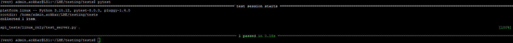

# Installation steps to run API tests

Run through the following steps to get API tests up and running on your Azure test bed.
Checkout the following main LME Branch on your Azure LME folder.
After the Git Pull has been completed, go to LME/testing folder and run the following command:
```
./SetupTestbed.ps1 -NumClients 2 -AutoShutdownTime 0000 -AllowedSources "<YourIPAddress>" -l <Location> -ResourceGroup <ResourceGroupName> -m  -y
```
Note: The -m option is for minimum install, will only install the Linux Server. If you want a full install, leave out -m from the above command.

After the above command has been completed, run the following command:
```
./InstallTestbed.ps1 -ResourceGroup <ResourceGroupName> -m -v 1.3.2  | Tee-Object -FilePath "./<ResourceGroupName>.output.log"
```
Note: -v 1.3.2 in above command is also optional. If not specified, it will default to latest main branch.

After above command has been completed, your test bed Linux Server has been set up. Next we will get it ready to run API tests. Run the following commands by doing SSH to the Linux server:
```
git clone "https://github.com/cisagov/LME.git"
cd LME
git checkout -t origin/cbaxley-168-python_tests
cd testing/tests/
python3 -m venv venv
. venv/bin/activate
pip3 install -r requirements.txt
export elastic=<yourelasticpassword>
pytest
```
When pytest command is run, the API tests will be executed and the results will be displayed.


